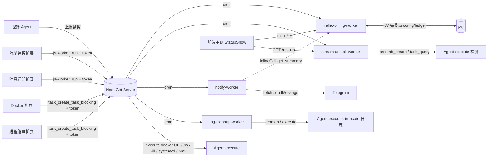

# NodeGet js-worker 套件 · 流量 / 流媒体 / 通知 / 日志清理 / Docker

> **仓库**：<https://github.com/laozig/js_workers>

为 [NodeGet](https://nodeget.com) 探针面板开发的一组 **js-worker** 与 **Dashboard 扩展**，全部运行在 NodeGet 边缘端（Server 内嵌的 QuickJS Runtime），**不改探针 agent 任何代码**。

## 全景

| 功能 | Worker | 扩展 | 鉴权 | 一句话 |
|---|---|---|---|---|
| **流量监控** | `traffic-billing-worker.js` | `traffic-extension/`（流量监控） | NodeGet Token | 逐台 opt-in 流量记账 + 配额阶梯告警 |
| **流媒体检测** | `stream-unlock-worker.js` | —（前端主题直读 `/results`） | 公开 | YouTube/Netflix 的 IPv4/IPv6 解锁检测 |
| **消息通知** | `notify-worker.js` | `notify-extension/`（消息通知） | NodeGet Token | 离线/上线/到期/超额 → Telegram |
| **日志清理** | `log-cleanup-worker.js` | —（`GET /run` 自助） | worker route | 清空各机 NodeGet 日志（truncate） |
| **Docker 管理** | —（纯扩展，无 worker） | `docker-extension/` | NodeGet Token | 远程管容器/镜像（execute + docker CLI） |
| **进程管理** | —（纯扩展，无 worker） | `process-extension/` | NodeGet Token | 进程(ps/kill)/端口/systemd/pm2 + 看任意日志（execute） |

---

## 两种架构（理解这个就懂全部）

### A. 有 worker（有状态 / 要后台）

凡是需要**累计、定时、持久化**的功能，必须有一个 worker 在 Server 端常驻：

- **流量监控**：每 5 分钟用探针计数器差值累加“本期已用”，存 KV，按月重置 —— 前端不可能代劳。
- **流媒体 / 通知 / 日志清理**：都靠各自的 **Server 定时任务（cron）**周期性跑。

> 经验法则：**要“持续统计/累计/定时”的，一定要 worker；只做“即时一次性操作”的，可以纯扩展。**

### B. 纯扩展（即时 / 无状态）

即时操作不需要 worker，扩展前端直接用 NodeGet Token 调核心 RPC：

- **Docker 管理**：列容器、启停、删除都是当下执行一条命令，前端 `task_create_task_blocking` 下发 `execute` 即可，**没有 worker**。

### 扩展的鉴权（统一 NodeGet Token）

三个扩展（Docker、流量监控、消息通知）**全部用 NodeGet Token**:安装时按 `app.json.limits` 创建**细粒度专属 Token**，经 iframe hash 传入，前端用它调核心 RPC。**不碰公开站、无需 route_secret、不再有跳转壳。**

- Docker：Token → `task_create_task_blocking`（**同步**，一步拿结果）。
- 流量监控 / 消息通知：Token → `js-worker_run`（`run_type=call`）触发 worker `onCall` → 轮询 `js-result_query`（**异步**，因为要调 worker）。

> 历史:通知早期是 worker 内置 `/ui` + `route_secret` 的跳转壳,已于 notify-worker v1.2 移除,统一到上面的 Token 方案。

---

## 架构 / 数据流



松耦合：notify 经 `inlineCall` 读 traffic 的告警节点；其余各自独立，缺一不可降级。

---

## 快速上手

> 所有 worker 都：**JS Worker → 新建 → 贴代码 → 保存** → **设置里填 route_name + env.token** → **建 Server 定时任务**（⚠️ 必做，否则不累计/不检测）。Cron 为 **6 段**（秒 分 时 日 月 周）。

| Worker | route_name | 建议 Cron | 说明 |
|---|---|---|---|
| `traffic-billing-worker` | `traffic-billing` | `0 */5 * * * *` | 每 5 分钟审计流量 |
| `stream-unlock-worker` | `stream-unlock` | `0 0 0,12 * * *` | 一天两次；首访 `GET /results` 或 `GET /run` 自举 |
| `notify-worker` | `notify` | `0 */2 * * * *` | 每 2 分钟检测事件；`/chatid` 通过 webhook 实时回复 |
| `log-cleanup-worker` | `log-cleanup` | 无需 Server cron | 改用 `GET /install` 给各机装本地清理 cron |

**扩展**（在「扩展管理 → 安装」装对应 zip）：

| 扩展 | zip | 依赖 worker | 安装时授权 |
|---|---|---|---|
| 流量监控 | `traffic-monitor-extension.zip` | `traffic-billing-worker` | JsWorker 运行 + JsResult 读 |
| Docker 管理 | `docker-manager-extension.zip` | 无 | Task 创建/读取 `execute` |
| 消息通知 | `notify-extension.zip` | `notify-worker` | JsWorker 运行 + JsResult 读 |

---

## 一、流量监控 · traffic-billing

**统计口径**：记的是**本计费周期内新增的流量增量**（worker 用计数器差值累加，到起算日清零），不是“开机以来累计”。按自然月、东八区起算日重置，短月自动落月末；计费方向出/入/双向；节点重启计数器归零自动容错。配额留空=只统计不告警，填数字→默认 80% 起每 +5% 一档告警；notify 可传入自定义提醒阈值。

- **Worker**：`onCall` 动作 `list` / `get_summary` / `get_config` / `set_config` / `audit_now` / `reset_node`。HTTP 路由 `GET /list`、`GET /summary`（公开，供 StatusShow 读）+ `/config`、`/audit`、`/reset`（`route_secret` 保护）。**已无内置 `/ui`**（配置面板移到扩展）。
- **扩展**（`traffic-extension/`）：iframe 完整 UI（不跳转），用 NodeGet Token 调 `js-worker_run` → 轮询 `js-result_query`。`app.json.limits` 已声明 `JsWorker::RunDefinedJsWorker` + `JsResult::Read`，scope `traffic-billing-worker`。两个入口：应用区=全部节点表格；每台机器页=单机视图。`WORKER_NAME` 须与 worker 脚本名一致。
- env：`token`（必填）；`route_secret`（可选，仅保护 `/config` 等写路由）。

## 二、流媒体检测 · stream-unlock

给目标 Agent 下发 `execute` 定时任务（`crontab_create`），Agent 本机 `curl -4/-6` 探测 YouTube Premium / Netflix，Server 端 `task_query` 聚合成 `/results`。首次自动安装长期 cron + `task_create_task_blocking` 补跑一次。

- **Worker**：`onCall` `list_targets` / `get_config` / `set_config` / `install_crons` / `list_crons` / `get_results`。HTTP `GET /results`（前端主题读）、`GET /run` 或 `POST /install`（立即安装+补跑）、`/targets` / `/config` / `/crons`。
- **目标不固化**：默认每轮跟随全部 Agent；只有显式带 `uuids` 才锁定子集。
- env：`token`（需 `Crontab::Write/Delete`、`Task::Create/Read(execute)`、`JsWorker::RunDefinedJsWorker`）。
- 展示口径只有四项：`YouTube IPv4` / `Netflix IPv4` / `YouTube IPv6` / `Netflix IPv6`（无 v6 出口的机器 v6 项为 `bad`，前端可隐藏）。

## 三、消息通知 · notify

离线/上线/到期/流量配额提醒 → Telegram（对齐 Komari）。90 秒无上报判离线、合并成条、失败重试；到期每天一次；流量经 `inlineCall` 读 traffic 告警节点,从可配置阈值(默认 80%)起每 +5% 档位提醒。离线/上线、到期/续费、流量配额提醒分别支持独立模板。

- **Worker**：`onCall` `get_config` / `set_config` / `test` / `run` / `get_state`；`onCron` 负责事件检测；`onRoute` 只负责 Telegram webhook 注册、注销和 update 接收，不提供内置 `/ui`。
- **扩展**（`notify-extension/`）：iframe 完整配置面板，用 NodeGet Token 调 `js-worker_run` → 轮询 `js-result_query`，和 Docker/流量监控一致。Telegram 的 `bot_token` / 通知目标列表 / `webhook_admin_secret` 可在扩展面板填（存 KV、打码回显）；每个通知目标可单独配置 Chat ID、话题 ID、离线、恢复、到期、流量和启用状态。离线/上线模板可使用 `{{clients}}`、`{{node_count}}`、`{{last_seen}}`、`{{offline_duration}}`、`{{offline_delay}}`、`{{tags}}` 等变量;到期/续费信息模板读取 `metadata_price`、`metadata_price_unit`、`metadata_price_cycle`、`metadata_expire_time` 与 `metadata_tags`;流量配额提醒模板可使用 `{{traffic_used}}`、`{{traffic_quota}}`、`{{traffic_percent}}`、`{{traffic_level}}`、`{{traffic_reset_day}}` 等变量。`{{event}}` 会按到期状态或流量使用率动态显示。worker token 建议给 Agent namespace 的 `metadata_*` 读权限;缺少标签/价格等可选字段权限时会降级为空。也可在 Telegram 内发送 `/chatid` 让 Bot 实时回复当前会话 ID。
- **Telegram webhook**：worker 需设置 `route_name`（示例 `notify`），并确保该 HTTPS 路由可被 Telegram 访问；保存 Bot Token 后访问 `https://你的域名/nodeget/worker-route/notify/registerWebhook` 注册。注册成功时会同步把 `chatid` 写入 Telegram 命令列表,用户输入 `/` 时可看到该快捷命令。如配置了 Webhook 管理密钥，注册、注销和查询时加 `?s=密钥`。注销为 `/unRegisterWebhook`，查询为 `/webhookInfo`。
- env：`token`（NodeGet 平台 Token，**不是** Telegram token）；`webhook_admin_secret`（可选，和扩展面板配置二选一或同时保留）。

## 四、日志清理 · log-cleanup

对每台 Agent 下发 `execute` 跑 `: > file`（truncate，保留文件），清 `/var/log/nodeget-agent/app.log`、`/var/log/nodeget-server/app.log`（不存在则跳过）。

- **Worker**：`onCall` `clean` / `install_crons` / `get_config` / `set_config` / `list_targets` / `get_last`。HTTP `GET /run`、`GET/POST /install`、`POST /clean`、`/config` / `/targets` / `/last`。
- **自助定时**（推荐）：部署后访问一次 `GET /install`，worker 用 `crontab_create` 给每台 Agent 装本地清理 cron（默认每天 04:00），**无需手动建 Server 任务**。`min_bytes` 可设只清超过阈值的日志。
- ⚠️ 破坏性操作；Agent 进程需对日志文件有写权限（root/属主），否则报 `denied`。

## 五、Docker 管理 · docker-extension（纯扩展，无 worker）

填补官方 board 里 WIP 的 Docker 页。iframe 内完整 UI，用 NodeGet Token 调 `task_create_task_blocking` 下发 `execute`（**docker CLI**，不是 Request 任务——Request 打不了 unix socket）。

- **能力**：容器（列表/日志/启停/重启/删除）、镜像（列表/拉取/删除）、运行新容器（表单，严格参数校验防注入）。
- **安全**：`app.json.limits` 声明 `Task::Create("execute")` + `Task::Read("execute")`；装进 board（登录后台），用安装时创建的专属 Token，不碰公开站。所有用户输入白名单校验 + 单引号包裹防 shell 注入。
- **前提**：目标机器装 `docker` CLI、Agent 进程可访问 `/var/run/docker.sock`。
- 两个路由：`node`（每台机器单机视图）、可后续加 `global`。

---

## 六、进程管理 · process-extension（纯扩展，无 worker）

填补官方愿望清单的「进程管理器（ps/kill）」。iframe 内完整 UI，用 NodeGet Token 调 `task_create_task_blocking` 下发 `execute`（`sh -c`）。五个 tab：

- **进程**：`ps aux`，按 CPU%/内存% 排序、搜索、用户/系统筛选（内核线程 `[...]` 归「系统」——root-VPS 上几乎全是 root/UID 0，内核线程才是唯一有效切分）；`kill` / `kill -9`（红按钮，二次确认）。
- **端口**：`ss -tulpn`（回退 `netstat`），监听端口 → 进程/PID，可直接结束占用进程。
- **systemd**：列服务、start/stop/restart/enable/disable、`systemctl status`、`journalctl -u` 真日志。
- **pm2**：`pm2 jlist`，restart/stop/start/delete、日志（直接 tail `pm_out/err_log_path`，绕开 `pm2 logs --nostream` 只吐 `[TAILING]` 横幅的坑）。
- **日志**：输入任意绝对路径 `tail -n N`，含常用快捷（syslog / nodeget-agent / nginx），路径做注入校验。
- **安全**：同 Docker——`Task::Create/Read("execute")`、装 board 鉴权、白名单校验 + 单引号包裹。⚠️ 不防呆：可杀任意进程（含 agent 自身，杀了会自断连接），readme 顶部有红字警告。

---

## 扩展打包

扩展源码在 `traffic-extension/`、`notify-extension/`、`docker-extension/`、`process-extension/`。用 **Python** 打包（保证 zip 内为**正斜杠**路径，避免 PowerShell `Compress-Archive` 的反斜杠坑，否则 board 在 Linux 解压会找不到 `resources/index.html`）：

```bash
# 在某个扩展目录里执行，生成 ../<名字>.zip
python - <<'EOF'
import zipfile, os
out = "../" + os.path.basename(os.getcwd()) + ".zip"
files = []
for root, _, fs in os.walk("."):
    for f in fs:
        p = os.path.join(root, f)
        if ".zip" not in p:
            files.append(p)
with zipfile.ZipFile(out, "w", zipfile.ZIP_DEFLATED) as z:
    for f in sorted(files):
        z.write(f, os.path.relpath(f, ".").replace(os.sep, "/"))
print("packed ->", out)
EOF
```

实际产物名：`traffic-monitor-extension.zip`、`notify-extension.zip`、`docker-manager-extension.zip`、`process-manager-extension.zip`（按需重命名）。

---

## 配套前端主题

[NodeGet-StatusShow](https://laozig-statusshow.pages.dev)（laozig 二开版）与 `traffic-billing-worker`、`stream-unlock-worker` 契合：卡片/表格直接显示**本月流量**（取自 `/list`）与 **YouTube/Netflix v4/v6 解锁**（取自 `/results`）；对应 worker 没装则自动隐藏。主控「主题管理」填托管地址即可一键拉取（需主控 ≥ 0.2.6）。

---

## KV 存储

| Worker | 命名空间 | Key | 内容 |
|---|---|---|---|
| traffic | 每节点 `<uuid>` | `traffic_billing_config` | `{enabled,billing_day,mode,quota_gb}` |
| traffic | 每节点 `<uuid>` | `traffic_billing_ledger` | `{snapshot:{累计/告警/周期}}` |
| notify | `global` | `notify_config` / `notify_state` | 配置（含 bot_token）/ 状态 |
| stream-unlock | `global` | `stream_unlock_agent_config` / `..._state` | 配置 / 安装与缓存状态 |
| log-cleanup | `global` | `log_cleanup_config` / `..._state` | 配置 / 上次清理结果 |

> route_secret 登录态不在 KV，只存访问者浏览器 `localStorage`。

---

## 常见问题

| 现象 | 处理 |
|---|---|
| 面板看不到流量 / 不累计 | 没建 traffic 定时任务，或机器没在配置里开启监控 |
| 流量扩展打不开 / 列表空 | 安装时没授予 JsWorker 运行 + JsResult 读权限；或 worker 脚本名 ≠ `traffic-billing-worker` |
| Docker 扩展报权限 | 机器没装 docker，或 Agent 无 `docker.sock` 访问权限（root/`docker` 组） |
| 日志清理 `denied` | Agent 进程对日志文件无写权限，需提权或改属主 |
| 通知完全不发 | notify 没建定时任务 / 没开总开关 / 目标未启用对应事件 / Telegram 没填 |
| 扩展装进 board 找不到页面 | zip 路径必须正斜杠（见「扩展打包」，用 Python 打包） |

---

## 二次开发

- worker 基于 **ES Module**：`export default { onCall, onInlineCall, onCron, onRoute }`，**不支持 `import`**；多文件用 esbuild 打包（`bundle:true, format:"esm", target:"es2022"`）。
- 全局能力：`nodeget(method, params)`（JSON-RPC）、`inlineCall(name, params, timeout?)`、`fetch`、`randomUUID`、标准 `Request`/`Response`/`URL`。
- 前端调 worker 两条路：**核心 RPC**（`task_create_task_blocking` 同步 / `js-worker_run`+`js-result_query` 异步）或 **worker `onRoute`**（`fetch /nodeget/worker-route/<route_name>/…` 同步）。
- 各 worker 的接口详表见同名 `*.description.md`（可粘到 Dashboard「设置」的描述字段，按 Markdown 渲染）；扩展用法见各 `*/readme.md`。
